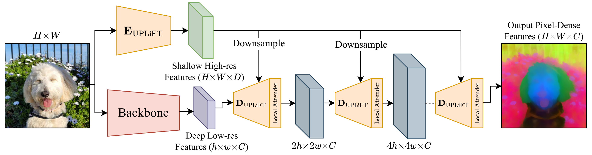

# UPLiFT: Universal Pixel-dense Lightweight Feature Transforms



This is the official code for "UPLiFT: Efficient Pixel-Dense Feature Upsampling with Local Attenders" a lightweight method to upscale the features of pretrained backbones to create pixel-dense features. This repository includes sample code to run pretrained UPLiFT models for several backbones, and training code to create UPLiFT models for new backbones.

Paper: https://arxiv.org/abs/2601.17950

Website: https://www.cs.umd.edu/~mwalmer/uplift/

## Installation

First, create and activate a conda environment:
```bash
conda create --name uplift python=3.12
conda activate uplift
```

Then install UPLiFT with the dependencies for your desired backbone:

**Option 1: Clone and install**
```bash
git clone https://github.com/mwalmer-umd/UPLiFT.git
cd UPLiFT
pip install -e '.[vit]'       # for DINOv2/DINOv3
# or: pip install -e '.[sd-vae]' for Stable Diffusion VAE
# or: pip install -e '.[all]'    for all backbones
```

**Option 2: Install from GitHub**
```bash
pip install 'uplift[vit] @ git+https://github.com/mwalmer-umd/UPLiFT.git'
# or: pip install 'uplift[sd-vae] @ git+https://github.com/mwalmer-umd/UPLiFT.git'
# or: pip install 'uplift[all] @ git+https://github.com/mwalmer-umd/UPLiFT.git'
```

## Quick Start

```python
import torch
from PIL import Image

# Load model (weights auto-download from HuggingFace)
model = torch.hub.load('mwalmer-umd/UPLiFT', 'uplift_dinov2_s14')

# Run inference
image = Image.open('image.jpg')
features = model(image)
```

## Available Models

| Model | Backbone | Load with |
|-------|----------|-----------|
| DINOv2-S/14 | ViT | `uplift_dinov2_s14` |
| DINOv3-S+/16 | ViT | `uplift_dinov3_splus16` |
| SD 1.5 VAE | Diffusion | `uplift_sd15_vae` |

## Options

```python
# Raw model only (no backbone)
model = torch.hub.load('mwalmer-umd/UPLiFT', 'uplift_dinov2_s14', include_extractor=False)

# Custom iterations
model = torch.hub.load('mwalmer-umd/UPLiFT', 'uplift_dinov2_s14', iters=2)
```

## Inference with Pretrained Models

Weights are automatically downloaded from HuggingFace when using `torch.hub.load()` or the `load_model()` function contained in `uplift/hub_loader.py`. In addition, we provide `sample_inference.py`, which can also be used to quickly run pretrained models or new models you train. For example:

Extract pixel-dense features with a pretrained UPLiFT for DINOv3-S+/16:
```
python sample_inference.py --pretrained uplift_dinov3-splus16 --image imgs/Gigi_1_512.png --iters 4
```

Extract pixel-dense features with a pretrained UPLiFT for DINOv2-S/14, using a forced output size:
```
python sample_inference.py --pretrained uplift_dinov2-s14 --image imgs/Gigi_2_448.png --iters 4 --outsize 448
```

Upsample an image with a pretrained UPLiFT trained for the SD1.5 VAE backbone:
```
python sample_inference.py --pretrained uplift_sd1.5vae --image imgs/Gigi_3_512.png --iters 2
```

If you train a new UPLiFT model for an existing supported backbone or a new backbone, you can manually specify the path to the config and ckpt for it and run inference as follows:
```
python sample_inference.py --config path/to/config.yaml --ckpt path/to/checkpoint.pth --image your_image.png --iters 4
```


## Training an UPLiFT Model

Before training, update **./uplift/datasets/datasets_helper.py** to specify the path(s) to your training dataset(s).

Config files are used to specify the UPLiFT architecture, the feature extracting backbone, and the training settings. Example config files can be found in **./uplift/configs/**. To train UPLiFT for a new model, create or modify an existing config file for the new backbone.

This repository includes two built-in methods for loading backbones. The first is in **./uplift/extractors/vit_wrapper.py** which uses **timm** for model loading. The second is in **./uplift/extractors/diff_extractor.py** which can load **Diffusers** pipelines from Hugging Face. Note that some pipelines may not be compatible with this wrapper. If so, the wrapper must be modified to appropriately run the VAE encoder and decoder elements of your specified pipeline. For other models, we recommend implementing an extractor wrapper similar to the two examples provided.

Once you have prepared the dataset, backbone, and config file, you can launch training with **train_uplift.py**. For example, the following command can be used to train an UPLiFT model from scratch with an existing sample config file:
```
python -m uplift.train_uplift --config uplift/configs/uplift_dinov2-s14.yaml
```


## Evaluations

We follow the evaluation protocols of [JAFAR](https://github.com/PaulCouairon/JAFAR) and [FM-Boost](https://github.com/CompVis/fm-boosting). Additional evaluation scripts will be provided in the near future.


## Acknowledgements

This work was made possible thanks to code provided by the following sources:
* https://github.com/Jiawei-Yang/Denoising-ViT for **uplift/extractors/vit_wrapper.py**
* https://gist.github.com/sayakpaul/3ae0f847001d342af27018a96f467e4e and https://github.com/huggingface/diffusers/ for resources used in **uplift/extractors/diff_extractor.py**
* https://github.com/PaulCouairon/JAFAR) for evaluation and PCA visualization code
* https://github.com/CompVis/fm-boosting for evaluation code
* https://github.com/facebookresearch/ConvNeXt for LayerNorm
* https://gist.github.com/andrewjong/6b02ff237533b3b2c554701fb53d5c4d for data loading resources


## License

Distributed under the MIT License.


## Citation

If you found UPLiFT useful, please cite our paper with the following:

```
@article{walmer2026uplift,
  title={UPLiFT: Efficient Pixel-Dense Feature Upsampling with Local Attenders},
  author={Walmer, Matthew and Suri, Saksham and Aggarwal, Anirud and Shrivastava, Abhinav},
  journal={arXiv preprint arXiv:2601.17950},
  year={2026}
}
```